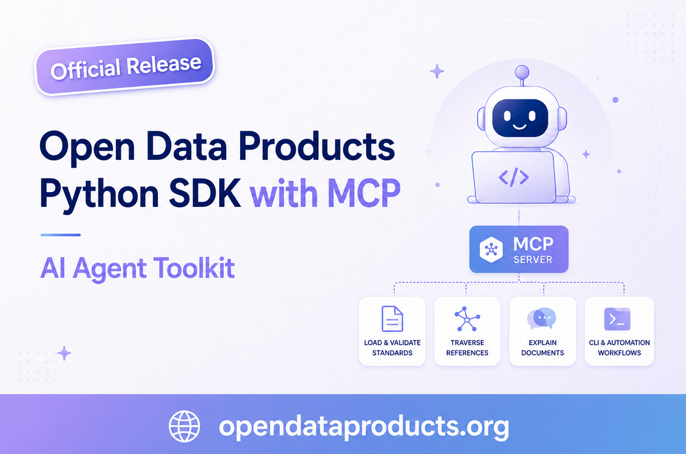

# Open Data Products Python SDK for AI Agents



[](https://badge.fury.io/py/open-data-products)
[](https://github.com/Open-Data-Product-Initiative/odps-python)
[](https://opensource.org/licenses/Apache-2.0)

An AI-agent-first Python SDK for the OpenDataProducts.org standards family. It gives agents, agent hosts, and automation systems one consistent surface for loading, detecting, validating, explaining, searching, traversing, and summarizing documents across:

* [Open Data Product Specification (ODPS)](https://opendataproducts.org/v4.1/), 
* [Open Data Product Catalog (ODPC)](https://opendataproducts.org/odpc-v1.0/), 
* [Open Data Product Graphs (ODPG)](https://opendataproducts.org/odpg-v1.0/), and
* [Open Data Product Vocabulary (ODPV)](https://opendataproducts.org/odpv-v1.0/).

The package still includes developer-facing Python helpers, but the primary contract is agent-ready: structured validation results, lightweight artifact summaries, reference discovery, Data Contract orchestration, bundled retrieval resources, a unified CLI, an MCP stdio server, and an ARWS agent manifest.

## Installation

```bash
pip install open-data-products

# Optional Data Contract validation adapter:
pip install "open-data-products[contracts]"

# Optional embedded llama.cpp generation support:
pip install "open-data-products[llama-cpp]"

# For development:
pip install "open-data-products[dev]"
```

## AI Agent-First SDK

### Why Agent First

- **One cross-spec entry point**: Agents can call `load_document`, `validate_document`, `explain_document`, and `resolve_references` across ODPS, ODPC, ODPG, and ODPV files.
- **Structured outputs**: Validation, references, resources, summaries, and graph reasoning helpers return predictable objects that are easy for agents to inspect.
- **Small-context workflows**: `load_summary` returns metadata, size, hash, spec, kind, and id without returning full document bodies.
- **Retrieval-ready resources**: Bundled schemas, prompt templates, vocabulary records, catalog object records, and graph object records are discoverable through `list_resources` and MCP tools.
- **Agent-ready ODPC and ODPV helpers**: Catalog building, catalog artifact checks, vocabulary term resolution, canonical term packets, relationship compatibility checks, and term context packets are available through Python, CLI, and MCP surfaces where safe.
- **Graph reasoning for agents**: ODPG helpers support graph summaries, traversal, strategic analysis, and trusted focus-node context extraction.
- **Data Contract orchestration**: Optional `datacontract-cli` integration validates external contracts while the SDK resolves ODPS contract references, extracts schemas, checks static product-contract alignment, and returns agent-ready reports.
- **Host integration**: MCP-capable tools can launch `open-data-products serve`, while ARWS-compatible systems can read the generated manifest.

### Unified Agent API

Use the top-level API when building AI agents, automation, validation pipelines, or tools that need to work across the Open Data Products standards family without knowing the spec namespace ahead of time:

```python
from open_data_products import (
    explain_document,
    generate_local_artifact,
    generate_local_artifacts,
    load_generation_prompt,
    list_resources,
    load_document,
    resolve_references,
    validate_document,
)

document = load_document("examples/product.yaml")
result = validate_document(document)

print(result.valid, result.spec, result.kind)
print(explain_document(document))

for reference in resolve_references(document):
    print(reference.pointer, reference.ref)

for resource in list_resources():
    print(resource.id, resource.spec, resource.type)

prompt = load_generation_prompt("odps_data_product_fragment.md")
signal = generate_local_artifact(
    "signal",
    "open_data_products/generation/source_docs/turnaround-delay-signal.txt",
    "open_data_products/generation/fragments",
)
all_artifacts = generate_local_artifacts(
    "open_data_products/generation/source_docs",
    "open_data_products/generation/fragments",
)
```

The top-level CLI exposes the same workflow with machine-readable output:

```bash
open-data-products validate examples/product.yaml --json
open-data-products explain examples/product.yaml --json
open-data-products refs graph.yaml --json
open-data-products resources --json
open-data-products summary examples/product.yaml      # lightweight reference: size, hash, spec
open-data-products manifest --json           # ARWS agent manifest
open-data-products serve                     # MCP server over stdio
```

Data Contract support is optional and product-oriented. The SDK recognizes
native ODPS `/product/contract` references (`$ref`, `contractURL`, and inline
`spec`) as well as practical extension-style references such as
`extensions.dataContract.href`. External contract lint/export uses
`datacontract-cli` when installed; inline ODPS contract specs are used for
static summaries and alignment without running live source tests.

```python
from open_data_products import (
    check_product_contract_alignment,
    extract_contract_schema,
    generate_product_contract_report,
    resolve_product_contracts,
    summarize_contract,
    validate_contract,
)

for reference in resolve_product_contracts("examples/product.yaml"):
    print(reference.pointer, reference.href)

print(validate_contract("examples/contract.yaml").passed)
print(extract_contract_schema("examples/contract.yaml").field_count)
print(check_product_contract_alignment("examples/product.yaml", "examples/contract.yaml").summary)
print(generate_product_contract_report("examples/product.yaml").summary)
```

### Agent Surface (MCP + ARWS)

Run `open-data-products serve` to expose the SDK as a local MCP server, or
`open-data-products manifest --json` to render the ARWS manifest. See
[Agent surface](docs/agent-surface.md) for Codex/Claude Code setup, MCP tools,
and bundled skills.

## Package Structure

Use `open_data_products.<spec>` namespaces for every standard:

| Namespace | Standard | Status |
|-----------|----------|--------|
| `open_data_products.odps` | Open Data Product Specification | Implemented |
| `open_data_products.odpc` | Open Data Product Catalog | Catalog helpers implemented |
| `open_data_products.odpg` | Open Data Product Graph | Graph helpers implemented |
| `open_data_products.odpv` | Open Data Product Vocabulary | Vocabulary tools implemented |

## Capabilities at a Glance

| Area | What agents and developers can do |
|------|-----------------------------------|
| Cross-spec API | Detect, load, validate, explain, summarize, and resolve references across ODPS, ODPC, ODPG, and ODPV |
| MCP + ARWS | Run a local stdio MCP server, expose safe tools, and generate an ARWS agent manifest |
| ODPS | Create, load, validate, serialize, and inspect ODPS v4.1 data product documents |
| ODPC | Build catalogs from fragments, validate catalogs, explain catalog metadata, search bundled catalog object guidance, and generate/check derived catalog schema artifacts |
| ODPG | Validate graphs, summarize nodes and edges, traverse relationships, analyze governance/strategy signals, and extract agent context |
| ODPV | Load, validate, search, generate vocabulary artifacts, resolve terms and aliases, explain canonical term packets, check relationships, and produce agent context for shared ODP terminology |
| Data Contracts | Resolve ODPS contract references, validate external contracts through optional `datacontract-cli`, extract schemas, check static alignment, and generate product-level reports |
| Portfolio workspaces | Build, refresh, sync, render, localize, and explain connected ODPC/ODPS/ODPG portfolio workspaces from objectives, use cases, signals, and product source lanes |
| Bundled resources | Discover schemas, examples, vocabulary records, catalog object records, and graph object records through the resource registry |

ODPS support is scoped to the 4.x generation of the specification. The SDK
primarily targets ODPS v4.1 and keeps backward-compatible support for ODPS v4.0
documents.

ODPS field validation includes ISO language, country, currency, date/time,
phone, email, and URI formats where those standards apply.


## Usage Guide

This README is intentionally a short landing page. Use the focused references
below for implementation details:

- [API reference](docs/API.md): Agent API, spec helper namespaces, ODPS models, validators, serialization, and examples.
- [Agent surface](docs/agent-surface.md): MCP server, ARWS manifest, and bundled skills for agent hosts.
- [Command guide](docs/commands.md): what each common CLI command does, what it reads, and what it writes.
- [LLM generation](docs/generation.md): Ollama, embedded llama.cpp, or configured external LLM source-doc to ODPC fragment and ODPG graph workflow.
- [Embedded llama.cpp guide](docs/llama-cpp.md): install the optional extra, configure a GGUF model path, and run local generation without a separate LLM server.
- [LLM selection guide](docs/llm-selection-guide.md): opinionated local and hosted model choices by SDK workflow.
- [Generation development notes](docs/generation-development.md): contributor-facing prompt pipeline, ODPS normalization, validation, repair, and testing guidance.
- [Portfolio development notes](docs/portfolio-development.md): contributor-facing portfolio workspace orchestration, renderer, localization, validation, and testing guidance.
- [Development notes index](docs/development.md): contributor-facing internals notes for complex SDK surfaces.
- [Data Contract workflows](docs/data-contracts.md): ODPS contract resolution, optional `datacontract-cli`, alignment, and reports.
- [Capability drift reports](docs/capability-drift/README.md): dated SDK alignment reports against upstream specification tooling.
- [Tooling development model](docs/tooling-development-model.md): human-facing explanation of how spec-level scripts mature into consolidated SDK capabilities.
- [Functional test report](docs/functional-test-report.md): public API, CLI, and MCP functional coverage matrix.
- [Example scripts](examples/): runnable ODPS examples, including v4.1 strategy and MCP access examples.
- [Course-style guides](examples/guides/README.md): Udemy-aligned SDK and portfolio lessons, with a beginner Python setup guide.
- [Sample apps](examples/apps/README.md): independent CLIs built on top of the SDK.
- [Agent handoff](llms.txt): compact machine-readable routing for AI agents.

### Common Workflows

Most commands print human-readable output by default; add `--json` when agents,
CI jobs, or scripts need a stable machine-readable response. See the
[command guide](docs/commands.md) for what each command reads, checks, and
produces.

```bash
# Cross-spec validation and summaries
open-data-products validate examples/product.yaml
open-data-products explain examples/odpc_catalog.yaml
open-data-products refs open_data_products/odpg/data/graph/graph.yaml
open-data-products summary examples/product.yaml

# Bundled agent resources
open-data-products resources --json
open-data-products resources --id generation.prompt.system --json
open-data-products resources --id odpc.objects --json
open-data-products resources --id odpv.terms --json
open-data-products resources --id odpg.objects --json
```

The LLM generation commands require a configured local or hosted provider. The
default is Ollama; embedded llama.cpp and hosted providers are configured in the
generation config. See [LLM generation](docs/generation.md#llm-setup).

Use the bundled default config and bundled prompts as-is:

```bash
# LLM generation
open-data-products generate \
  --input source_docs/products/ \
  --kind product-reference \
  --output generated/

open-data-products generate \
  --input source_docs/turnaround-delay-signal.txt \
  --kind signal \
  --output generated/
```

Customize provider, model, or paths with a project-owned config:

```bash
open-data-products config generation --copy-to my-generation.config.yaml
open-data-products config generation --config my-generation.config.yaml --print
open-data-products config generation --config my-generation.config.yaml --check

open-data-products generate \
  --config my-generation.config.yaml \
  --input source_docs/products/ \
  --kind product-reference \
  --output generated/
```

The config check verifies required provider/model settings, catches common key
typos, rejects secret-looking values, and confirms configured input and prompt
paths exist before generation runs.

When installed from PyPI, the bundled generation config lives inside the
package as a template. Copy it to a project-owned file before editing provider
or model settings; do not edit files under `site-packages`. The
`my-generation.config.yaml` name below is only an example for your copied file.
You can also pass a folder path, such as `--copy-to config/`, and missing
folders are created automatically.

Override the configured provider or model for a single run when testing a
different LLM:

```bash
open-data-products generate \
  --config my-generation.config.yaml \
  --provider ollama-gemma3n \
  --input source_docs/products/ \
  --kind product-reference \
  --output generated/

open-data-products generate \
  --config my-generation.config.yaml \
  --provider lmstudio-gemma4-e4b \
  --input source_docs/products/ \
  --kind product-reference \
  --output generated/

open-data-products generate \
  --config my-generation.config.yaml \
  --provider groq \
  --model openai/gpt-oss-120b \
  --input source_docs/products/ \
  --kind product-reference \
  --output generated/

open-data-products generate \
  --config my-generation.config.yaml \
  --provider claude \
  --model claude-sonnet-4-5 \
  --input source_docs/turnaround-delay-signal.txt \
  --kind signal \
  --output generated/
```

The bundled config includes local presets for common laptop and workstation
models. Sweet-spot presets include `ollama-gemma3n`, `ollama-qwen25`,
`ollama-qwen3`, `ollama-llama`, `ollama-mistral`, `ollama-phi`, and
`lmstudio-gemma4-e4b`. Larger local presets include `ollama-qwen25-14b`,
`ollama-qwen3-14b`, `ollama-deepseek14b`, `ollama-large-q4`, and
`lmstudio-gemma4-12b`. Pull or load the model in the selected runtime before
running generation.

For direct GGUF inference without a separate local LLM server, install optional
embedded llama.cpp support and select a `llama-cpp` provider:

```bash
pip install "open-data-products[llama-cpp]"
```

```yaml
providers:
  llamacpp-embedded:
    type: llama-cpp
    model: local-gguf
    modelPath: models/qwen2.5-7b-instruct-q4_k_m.gguf
    contextWindow: 8192
    gpuLayers: -1
```

Generation uses bundled prompt templates by default. If you want to customize
the prompts, copy them to a project-owned folder, edit the Markdown files, and
pass that folder with `--prompts`:

```bash
open-data-products config generation --copy-prompts-to prompts/

open-data-products generate \
  --config my-generation.config.yaml \
  --prompts prompts/ \
  --input source_docs/signals/ \
  --kind signal \
  --output generated/
```

```bash
# Generated fragment artifacts
open-data-products validate open_data_products/generation/fragments/odpg_graph.yaml
open-data-products odpg-generate open_data_products/generation/fragments/odpg_graph.yaml --output /tmp/odp-generation-graph.html

# ODPC catalog helpers
open-data-products odpc-build examples/odpc_catalog_fragments/ --output /tmp/odp-catalog.yaml
open-data-products odpc-build examples/odpc_catalog_fragments/ --output /tmp/odp-catalog.yaml --html /tmp/odp-catalog.html
open-data-products odpc-build examples/odpc_catalog_fragments/ --output /tmp/odp-catalog.yaml --toon /tmp/odp-catalog.toon --gcf /tmp/odp-catalog.gcf
open-data-products odpc-summary /tmp/odp-catalog.yaml
open-data-products odpc-search "catalog data" --limit 3

# ODPV vocabulary helpers
open-data-products odpv-summary
open-data-products odpv-search "governance policy risk" --limit 3
open-data-products odpv-resolve "reusable data asset"
open-data-products odpv-explain DataProduct
open-data-products odpv-relationship DataProduct supports UseCase
open-data-products odpv-context DataProduct

# ODPG graph reasoning
open-data-products odpg-summary open_data_products/odpg/data/graph/graph.yaml
open-data-products odpg-traverse open_data_products/odpg/data/graph/graph.yaml --start AGENT-AVIATION-001 --depth 2
open-data-products odpg-analyze open_data_products/odpg/data/graph/graph.yaml
open-data-products odpg-agent-context open_data_products/odpg/data/graph/graph.yaml --node AGENT-AVIATION-001 --depth 2
open-data-products odpg-build examples/odpc_catalog_fragments/ --output /tmp/odp-graph.yaml --toon /tmp/odp-graph.toon --gcf /tmp/odp-graph.gcf
open-data-products odpg-convert --input examples/graph.graphml --output /tmp/odp-converted-graph.yaml
open-data-products odpg-generate open_data_products/odpg/data/graph/graph.yaml --output /tmp/odp-graph-explorer.html

# Portfolio workspace orchestration
open-data-products portfolio build \
  --objectives source_docs/objectives/ \
  --use-cases source_docs/use-cases/ \
  --signals source_docs/signals/ \
  --products source_docs/products/ \
  --output generated/portfolio/
open-data-products portfolio refresh generated/portfolio/
open-data-products portfolio sync generated/portfolio/
open-data-products portfolio localize generated/portfolio/ \
  --languages "fi,sv,ar,vi" \
  --provider claude \
  --model claude-sonnet-4-5

# Product-level Data Contract inspection
open-data-products product resolve-contracts examples/product.yaml --json
open-data-products product contract-schema examples/contract.yaml --json
```

See [Data Contract workflows](docs/data-contracts.md) for product contract
resolution, optional `datacontract-cli` integration, alignment checks, reports,
and supported ODPS contract reference shapes.
Live LLM generation requires Ollama or a configured provider API key; see
[LLM generation](docs/generation.md) for runnable provider examples.

### Spec-Specific Entry Points

- `open_data_products.generation`: editable prompt templates and provider-backed
  generation helpers for ODPS, ODPC, and ODPG YAML artifacts. Defaults to local
  Ollama/Qwen 2.5 and can use copied config templates for embedded llama.cpp,
  OpenAI-compatible runtimes, and hosted providers such as OpenAI.
- `open_data_products.odps`: ODPS v4.1 models, standards-aware validation, YAML/JSON I/O, compliance helpers, and `pricing_to_402`.
- `open_data_products.odpc`: ODPC catalog building, loading, validation, explanation, and object guidance search.
- `open_data_products.odpg`: ODPG graph validation, summary, traversal, analysis, agent context, object search, external graph conversion, and graph explorer generation.
- `open_data_products.odpv`: ODPV vocabulary loading, validation, search, and generated vocabulary artifacts.

## Development

```bash
git clone https://github.com/Open-Data-Product-Initiative/odps-python
cd odps-python
pip install -e ".[dev]"
python examples/basic_usage.py
```

### Dependencies

The library requires the following runtime packages:
- `PyYAML`: YAML format support
- `jsonschema`: ODPC and ODPG schema validation

## Error Handling

The library provides detailed validation error messages that reference specific standards:

```python
try:
    odp.validate()
except ODPSValidationError as e:
    print(e)
    # Output: "Validation errors: Invalid ISO 639-1 language code: 'xyz'; 
    #          dataHolder email must be a valid RFC 5322 email address"
```

## Examples

### ODPS v4.1 Example
See [examples/odps_v41_example.py](examples/odps_v41_example.py) for a demonstration of key v4.1 features including:
- ProductStrategy with business objectives
- KPI definitions with targets and calculations
- AI agent integration via MCP
- Enhanced $ref support

Run the example:
```bash
python examples/odps_v41_example.py
```

### Additional Examples
- [Basic ODPS Creation](examples/basic_usage.py)
- [Comprehensive ODPS Document](examples/comprehensive_example.py)
- [Advanced Features](examples/advanced_features.py)
- [ODPC catalog fragments](examples/odpc_catalog_fragments/) plus generated
  [catalog YAML](examples/odpc_catalog.yaml) and
  [standalone HTML](examples/odpc_catalog.html)

### Generation Inputs And Outputs
See [LLM generation](docs/generation.md) for source documents, prompts,
provider configuration, generated fragments, ODPG graph YAML, and graph explorer
output.

### Sample Apps
The [examples/apps/](examples/apps/README.md) folder contains independent, runnable Python
sample apps built on top of the SDK. Each app lives in its own folder with a
`cli.py` entry point and can be run directly from the repository root.

- [ODP Document Inspector CLI](examples/apps/document_inspector/cli.py): inspect any ODPS, ODPC, ODPG, or ODPV YAML/JSON document and print validation, explanation, references, and bundled resource metadata.
- [ODPV Vocabulary Finder CLI](examples/apps/vocabulary_finder/cli.py): search bundled ODPV terms by natural-language query and print definitions, scores, matched fields, and related terms.
- [ODPS Pricing 402 Builder CLI](examples/apps/pricing_402_builder/cli.py): build an HTTP 402 payment envelope from an ODPS product with pricing plans.

```bash
python examples/apps/document_inspector/cli.py examples/apps/pricing_402_builder/priced_product.yaml
python examples/apps/vocabulary_finder/cli.py "governance policy risk" --limit 5 --json
python examples/apps/pricing_402_builder/cli.py examples/apps/pricing_402_builder/priced_product.yaml --json
```

## Acknowledgments

We extend our gratitude to the following:

**[Open Data Product Initiative Team](https://opendataproducts.org/)** - Special thanks to the team at opendataproducts.org for creating and maintaining the emerging Open Data Product standards family, including the Open Data Product Specification (ODPS), Open Data Product Catalog (ODPC), Open Data Product Graphs (ODPG), and Open Data Product Vocabulary (ODPV). Their vision of standardizing data product descriptions, catalogs, graphs, and shared vocabulary has made this SDK possible. These specifications represent years of collaborative effort from industry experts, data practitioners, and open source contributors who are driving the future of data standardization.

**[Chris Howard / Kitard](https://github.com/Kitard)** - Special thanks to Chris Howard from Accenture for creating the original `odps-python` library. His foundational work made it possible to extend the project into the broader Open Data Products SDK and agent toolkit.

**[devlouie](https://github.com/devlouie)** - Special thanks to devlouie for contributing the MCP layer and Agent Surface on top of the SDK, helping make the Open Data Products standards family easier to use from agentic tools and workflows.

**[Data Contract CLI](https://github.com/datacontract/datacontract-cli)** - Special thanks to Stefan Negele, Jochen Christ, and Simon Harrer for creating Data Contract CLI, the open source execution engine this SDK can optionally use for external Data Contract validation, export, and ecosystem interoperability.

**Python Community** - For the exceptional ecosystem of libraries and tools that power this implementation, including PyYAML, jsonschema, and the countless other packages that make Python development a joy.

**Data Community** - For embracing open standards and driving the need for better data product specifications and tooling that benefits everyone in the data ecosystem.

**Documentation Support** - Documentation assistance provided by Claude (Anthropic).

## Contributing

Contributions are welcome. Please read CONTRIBUTING.md for guidelines, browse
the [open issues](https://github.com/Open-Data-Product-Initiative/odp-agent-sdk/issues),
and consider helping with new features, bug fixes, examples, documentation, or
agent-facing workflow improvements.

## License

Apache License 2.0 - see LICENSE file for details.

## Links & References

- [Open Data Product Specification v4.1](https://opendataproducts.org/v4.1/)
- [ODPS Schema](https://opendataproducts.org/v4.1/schema/)
- [Open Data Product Catalog (ODPC)](https://opendataproducts.org/odpc-v1.0/) 
- [Open Data Product Graphs (ODPG)](https://opendataproducts.org/odpg-v1.0/) 
- [Open Data Product Vocabulary (ODPV)](https://opendataproducts.org/odpv-v1.0/) 
- [Open Data Product Standards Knowledge Base](https://opendataproducts.org/howto) 
- [ISO 639-1 Language Codes](https://en.wikipedia.org/wiki/List_of_ISO_639-1_codes)
- [ISO 3166-1 Country Codes](https://en.wikipedia.org/wiki/ISO_3166-1_alpha-2)
- [ISO 4217 Currency Codes](https://en.wikipedia.org/wiki/ISO_4217)
- [ISO 8601 Date/Time Format](https://en.wikipedia.org/wiki/ISO_8601)
- [E.164 Phone Number Format](https://en.wikipedia.org/wiki/E.164)
- [RFC 5322 Email Format](https://datatracker.ietf.org/doc/html/rfc5322)
- [RFC 3986 URI Format](https://datatracker.ietf.org/doc/html/rfc3986)
