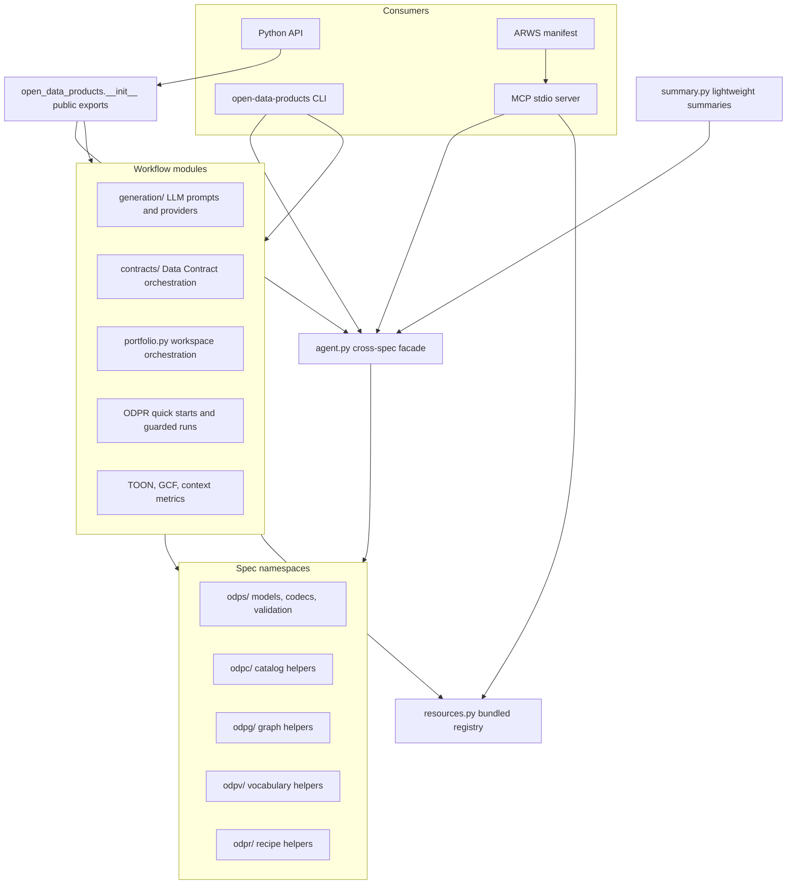
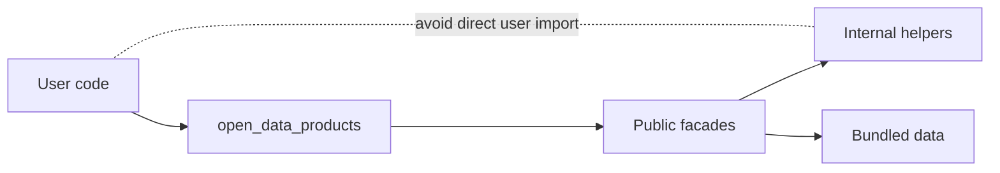
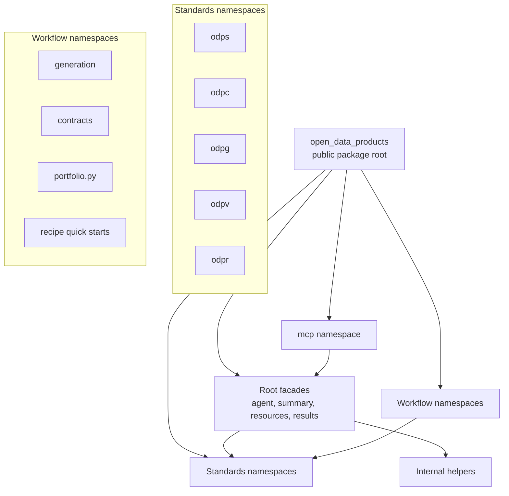
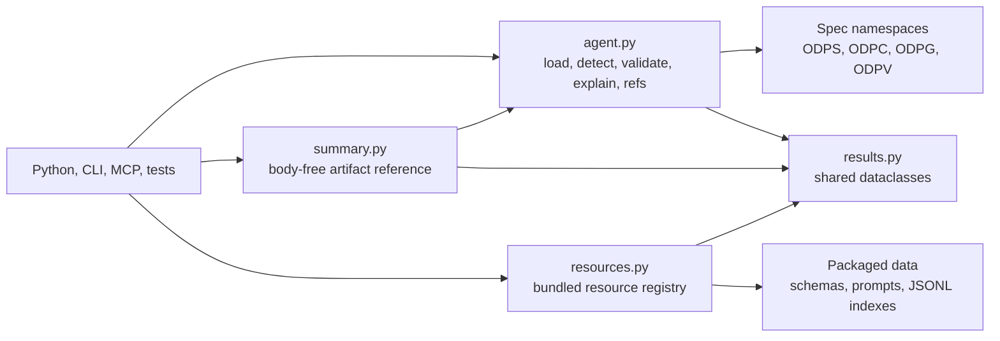
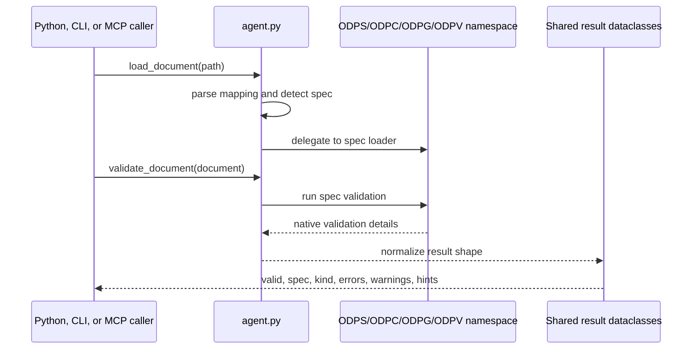
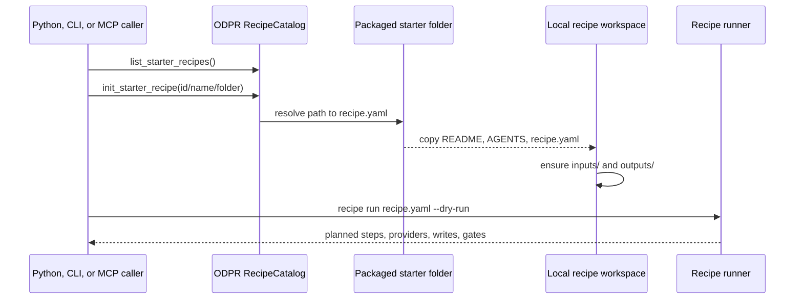
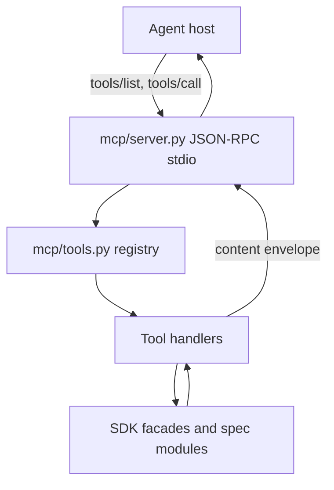
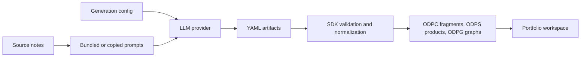
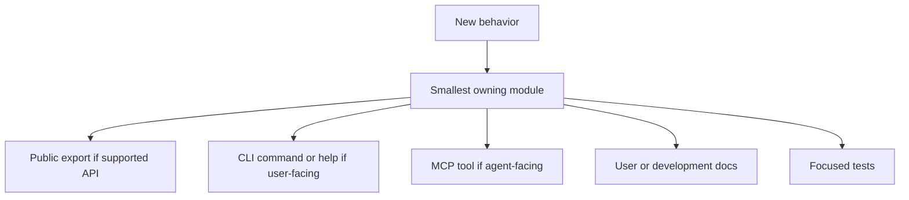

# SDK Architecture Overview

This page gives new contributors a high-level map of the Open Data Products
Python SDK. It explains the main parts, how data moves through them, and where
to start when adding a feature. It is intentionally broad; use the focused
development notes for implementation rules in each area.

## What the SDK Is

The package `open_data_products` is a Python SDK, command line tool, and local
agent surface for the OpenDataProducts.org standards family:

- ODPS: data product specifications
- ODPC: data product catalogs
- ODPG: data product graphs
- ODPV: vocabulary and term context
- ODPR: workflow recipes and recipe catalogs

The architecture has two layers. Spec-specific modules know the details of one
standard. Cross-spec modules expose common workflows such as load, detect,
validate, explain, summarize, list resources, serve MCP tools, and generate
artifacts.

## Main Parts

| Part | Purpose | Typical files |
| --- | --- | --- |
| Public API | Stable imports for SDK users. New public exports are listed explicitly. | `open_data_products/__init__.py` |
| Cross-spec layer | Load, detect, validate, explain, summarize, resolve references, and describe bundled resources without callers needing to choose the spec namespace first. | `agent.py`, `summary.py`, `resources.py`, `results.py` |
| Spec namespaces | Implementation details for ODPS, ODPC, ODPG, ODPV, and ODPR. | `odps/`, `odpc/`, `odpg/`, `odpv/`, `odpr/` |
| CLI surface | Human-readable default commands plus `--json` for scripts and agents. | `cli.py`, `cli_core.py`, `cli_product.py`, spec `cli.py` files |
| MCP and manifest | Safe local agent tools and ARWS manifest output. | `mcp/tools.py`, `mcp/server.py`, `mcp/manifest.py` |
| Bundled resources | Schemas, prompts, examples, vocabulary records, and guidance indexes. | `resources.py`, package `data/` folders |
| Generation | Prompt rendering, provider resolution, local/hosted LLM calls, YAML normalization, and repair loops. | `generation/` |
| Data Contracts | Optional external contract validation plus ODPS contract reference and alignment workflows. | `contracts/` |
| Portfolio workflows | Multi-artifact ODPC, ODPS, and ODPG workspace build, refresh, sync, render, localize, and explain flows. | `portfolio.py`, `portfolio_sources.py` |
| ODPR recipes | Recipe validation, RecipeCatalog discovery, starter workspace initialization, dry-run planning, and guarded execution. | `odpr/`, `odpr/data/starters/` |

## Import And Boundary Rules

The public package root is a deliberate boundary. If a function or type should
be part of the supported SDK contract, export it from
`open_data_products/__init__.py` and add it to `__all__`.

Internal modules use a leading underscore and should stay behind a stable
facade. For example, `_toon.py`, `_gcf.py`, and `_context_metrics.py` support
compact-context workflows, but user-facing code should normally call catalog,
graph, CLI, or public API helpers instead of importing these modules directly.

## Namespaces

The SDK uses Python namespaces to keep ownership clear. A namespace is the
folder or module prefix after `open_data_products`, such as
`open_data_products.odps` or `open_data_products.generation`. New contributors
should read the namespace as a signal about responsibility, not only as an
import path.

| Namespace | Owns | Use it when |
| --- | --- | --- |
| `open_data_products` | Public package root and stable supported imports. | You are writing user-facing code and want the documented SDK API. |
| `open_data_products.odps` | ODPS product models, codecs, enums, normalization, and validation. | The behavior is specific to Open Data Product Specification documents. |
| `open_data_products.odpc` | Catalog loading, fragment collection, catalog building, rendered catalog artifacts, and object guidance. | The behavior is about ODPC catalogs or catalog-derived outputs. |
| `open_data_products.odpg` | Graph loading, building, conversion, validation, traversal, analysis, context extraction, and graph explorer output. | The behavior is about ODPG graph documents or graph reasoning. |
| `open_data_products.odpv` | Vocabulary loading, validation, term search, alias resolution, relationship checks, and term context packets. | The behavior is about canonical vocabulary terms or term relationships. |
| `open_data_products.odpr` | Recipe, Provider, and RecipeCatalog validation; configured recipe listing; packaged starter discovery; starter workspace initialization; dry-run planning; and guarded execution. | The behavior is about ODPR workflow contracts or recipe quick starts. |
| `open_data_products.generation` | Prompt loading, source document handling, provider configuration, LLM calls, generated artifact normalization, validation, and repair. | The behavior turns source notes into ODPC, ODPG, or ODPS YAML. |
| `open_data_products.contracts` | Data Contract loading, optional `datacontract-cli` adapter use, contract references, schema summaries, alignment, exports, and reports. | The behavior connects ODPS products to external or inline Data Contracts. |
| `open_data_products.mcp` | Tool registry, stdio JSON-RPC server, and ARWS manifest. | The behavior exposes SDK capabilities to agent hosts. |
| Root modules such as `agent.py`, `summary.py`, `resources.py`, `pricing.py`, and `portfolio.py` | Cross-spec facades or product-level workflows that do not belong to exactly one standards namespace. | The behavior coordinates multiple specs or provides a package-level workflow. |
| Internal helpers such as `_toon.py`, `_gcf.py`, `_io.py`, and `_search.py` | Shared implementation details used by public modules. | You are working inside the SDK implementation; do not make these direct user-facing imports. |

The practical rule is: put detailed standards behavior in the matching spec
namespace, put reusable output shapes in `results.py`, put packaged asset
metadata in `resources.py`, and expose stable user imports through
`open_data_products/__init__.py` only when the behavior is meant to be public.

## Cross-Spec Layer

The cross-spec layer is the SDK's thin translation layer between consumer
surfaces and spec-specific implementations. It exists so Python users, CLI
commands, MCP handlers, tests, and agent hosts can ask the same questions of
ODPS, ODPC, ODPG, ODPV, and ODPR artifacts without duplicating detection or
response formatting logic.

The four files in this layer have different responsibilities:

| File | Role | What it should not do |
| --- | --- | --- |
| `agent.py` | Detects document type, loads the matching spec object, delegates validation and explanation to the owning namespace, and normalizes cross-spec reference discovery. | It should not become the home for detailed ODPS, ODPC, ODPG, or ODPV business rules. Those stay in the spec namespaces. |
| `summary.py` | Returns fixed-shape artifact metadata such as path, byte size, line count, hash, detected spec, kind, id, and compact-context sidecar references. | It should not return full document bodies; summaries are for cheap agent handoff. |
| `resources.py` | Registers bundled schemas, prompts, examples, vocabulary records, catalog object guidance, and graph guidance under stable resource IDs. | It should not parse or validate those resources; it only describes where packaged assets live. |
| `results.py` | Defines small serializable dataclasses such as `ValidationResult`, `Reference`, and `Resource`. | It should not contain workflow logic; these types are the shared output language used by other modules. |

When adding a new cross-spec capability, ask two questions first: does the
logic belong to one standard, or does it coordinate several standards? If it
belongs to one standard, implement it in that namespace and optionally expose a
small wrapper through `agent.py`. If it coordinates several standards or exists
only to provide a stable result shape, the cross-spec layer is the right place.

## Document Lifecycle

Most workflows start with a YAML or JSON artifact. The SDK detects which
standard it belongs to, sends it to the matching namespace, and returns a
shared result shape. This is why `ValidationResult`, `Reference`, and
`Resource` live at the package root: they are the common language between
Python, CLI, MCP, and agent hosts.

`summary.py` is a special case. It returns metadata, hashes, IDs, and context
artifact references without returning the full document body. Use it when an
agent or workflow needs to pass around a reference cheaply.

## ODPR Recipe Workflows

ODPR adds a workflow layer on top of the document namespaces. A `Recipe` is the
executable workflow contract, a `Provider` describes model or runtime defaults,
and a `RecipeCatalog` is metadata-only discovery that points to full recipe
files. The SDK keeps those roles separate: catalog entries list intent and
commands, while recipe files keep step bodies and execution policy.

Packaged starters live under `open_data_products/odpr/data/starters/` and are
listed through the bundled `catalog.yaml`. `recipe init` resolves a catalog
entry by id, English name, or folder name, copies the referenced starter folder,
creates `inputs/` and `outputs/`, and refuses existing output unless `--force`
is explicit. Dry-run planning and guarded execution continue to flow through
the existing recipe runner.

The public ODPR helpers are exported explicitly from the package root when
they are part of the supported SDK API. MCP discovery and catalog-check tools
are safe. MCP starter initialization is classified as `state-changing` because
it creates a workspace on disk.

## Agent Surfaces

The SDK exposes agent behavior in three related forms:

- Python functions for embedding in applications and tests
- CLI commands for people, scripts, CI, and local workflows
- MCP tools for agent hosts that can call local tools over stdio

Most MCP tools are safe-class inspection, validation, search, or planning
tools. Tools that create local files must be classified explicitly. Today
`init_starter_recipe` is `state-changing`; it initializes a recipe workspace
from a packaged starter. Tool handlers live in `mcp/tools.py`, return MCP
content envelopes, and delegate to the same facades used by Python and CLI
workflows.

## Generation And Portfolio Flow

Generation turns source notes into standards artifacts. The generation package
owns prompt loading, config precedence, provider clients, task selection,
normalization, validation, and repair. Portfolio workflows compose those pieces
into a larger workspace that contains catalogs, product specs, graph artifacts,
HTML, localization files, and version reports.

Keep YAML as the source of truth. TOON and GCF sidecars are compact-context
outputs for agents, not replacements for canonical ODPC or ODPG YAML.

## Where To Add Code

Start from the smallest module that owns the behavior:

- ODPS document model or validation behavior belongs under `odps/`.
- ODPC catalog building, catalog artifacts, and object guidance belong under
  `odpc/`.
- ODPG graph construction, conversion, traversal, analysis, and explorer
  rendering belong under `odpg/`.
- ODPV vocabulary search, resolution, relationship, and context behavior belong
  under `odpv/`.
- ODPR recipe validation, RecipeCatalog discovery, starter initialization,
  dry-run planning, and guarded execution belong under `odpr/`.
- Cross-spec load, detect, validate, explain, and references belong in
  `agent.py`.
- Shared result shapes belong in `results.py`.
- Bundled schemas, prompts, and guidance indexes are listed in `resources.py`.
- CLI wiring belongs in `cli.py`, `cli_core.py`, `cli_product.py`, or a
  spec-specific CLI module.
- MCP tools belong in `mcp/tools.py`; server protocol behavior belongs in
  `mcp/server.py`; manifest behavior belongs in `mcp/manifest.py`. Set the
  tool `class` to `safe`, `state-changing`, or `destructive` according to the
  actual side effects.

Avoid creating parallel validation or helper modules when an existing namespace
already owns the behavior. The repo already has some historical splits, so new
work should reduce confusion rather than extend it.

## Contributor Workflow

For behavior changes, update tests first or alongside the change. Public API,
CLI, and MCP behavior are connected surfaces, so a feature often needs a small
change in more than one place:

Before finishing work, run the repository checklist from `AGENTS.md`:

1. `pytest -q`
2. `python -c "import open_data_products"`
3. `python -m open_data_products.cli manifest --json | python -m json.tool`
4. Confirm no new files were created in `docs/superpowers/`

## Related Development Notes

- [Agent surface development](agent-surface.md)
- [MCP development](mcp.md)
- [Generation development](generation.md)
- [Portfolio development](portfolio.md)
- [ODPS validation development](odps-validation.md)
- [ODPC catalog development](odpc-catalog.md)
- [ODPG graph development](odpg-graph.md)
- [Data Contracts development](data-contracts.md)
- [TOON development](toon.md)
- [GCF development](gcf.md)
- [Visual HTML architecture page](sdk-architecture.html)
